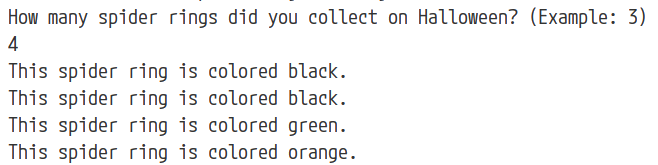

**PRIMM Activity: Counting Candy with Python FOR Loops**

**Scenario:** You and your friend went trick-or-treating and got a huge bag of candy on Halloween\! Let's write some Python code to help us figure out how much candy each person gets.

**Predict (5 minutes):**

1. Check out the following code snippet:
```
candy_list = ["Snickers", "Twix", "M&M's", "Starburst", "Lollipop"]  
total_candy = 0

for candy in candy_list:  
    # What will happen inside this for loop?
```

Write down your prediction of what the code will output (display).  How many candies will it count?

> I predict...


**Run (5 minutes):**

1. Open VS Code and paste in the code snippet from the Predict step.

2. Update the code snippet so it matches the snippet below.

```
candy_list = ["Snickers", "Twix", "M&M's", "Starburst", "Lollipop"]
total_candy = 0

for candy in candy_list:

  total_candy += 1

print("Total pieces of candy: ", total_candy)  
```

3. Run the script in VS Code and see what happens. **Did your prediction match the actual output?**

> Answer…


**Investigate (10 minutes):**

1. Let's break down the code. What does the line `for candy in candy_list:` do?

> Answer… 


2. What happens inside the loop each time the loop iterates (loops)?

> Answer… 


3. Explain what the variable `total_candy` is used for in the loop.

> Answer…

**Modify (10 minutes):**

1. Let's say you want to share the candy equally with your friend. Modify the code to print how much candy each of you gets (assuming you split it evenly).

2. What changes did you make to the code to accomplish this? Summarize your changes below.
> Answer...

**Make (15 minutes):**

1. Imagine you also collected some spooky spider rings! Create a new list called `rings` that contains 3 different colors (e.g., "black", "green", "orange").

2. Write a new Python script that uses a FOR loop to loop through the `rings` list and print out a message, such as "This spider ring is (color)".

**Bonus Challenge:**

* Modify your script from the "Make" section to ask the user how many rings they got on Halloween and then create a list with that many rings, each with its own randomly selected color.

  * HINT: You’ll first need to `import` the **random** module at the very top of your script

  * How could you use the Python `range( )` function with your **for** loop to tell Python how many times your loop should loop?

  * Set up your `rings` list as an empty list initially

  * You’ll also need a Python list of 5 - 7 different colors 

  * The [choice ( ) method](https://www.w3schools.com/python/ref\_random\_choice.asp) is your friend in this project!

**Sample Output**  
Your output should look similar to this example:

